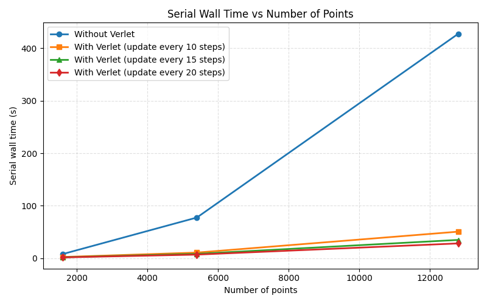
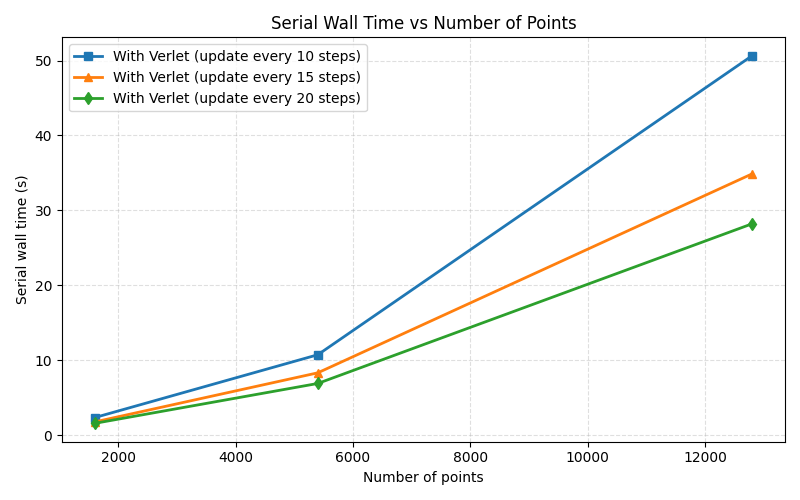

# Verlet List Assignment Report

| Name | Roll Number |
| --- | --- |
| Aryan Agarwal | 22EC39006 |
| Arkaprova Haldar | 22EC39005 |
| Ayush Prasad | 22EC39008 |
| Palla Sri Harsha Vardhan | 22MA10040 |

## Methodological Change

The simulation now uses a Verlet neighbor list to reduce the cost of force evaluation. Earlier, the molecular dynamics loop advanced the system and then evaluated Lennard-Jones interactions through a direct all-pairs scan. The revised formulation separates neighbor searching from force evaluation, so the interaction kernel operates only on preselected neighbors.

- The system is initialized and velocities are assigned.
- `new_verlet` builds the neighbor list after `initialize` outside the `main` loop.
- `new_verlet` is called again whenever the rebuild interval `vsteps` is reached, before the `integrate` step inside the `main` loop.
- `force_calc` uses the stored neighbor list instead of scanning all pairs.

This makes the neighbor-list update explicit rather than implicit. It also reduces the force work from global pairwise checking to a local neighborhood search.

## Parameterization of the Neighbor List

The cutoff radius and the Verlet radius were taken to be equal, so that the neighbor-list search and the force cutoff use the same interaction range:

$$
r_c = r_v = 10\ \mathrm{\AA}
$$

Using the three simulation sizes, the density estimate is

$$
\rho = \frac{N}{L^3}
$$

with the corresponding values:

| Configuration | $N$ | $L$ (Å) | $\rho$ (atoms Å$^{-3}$) | $k_{\mathrm{est}}$ |
| --- | ---: | ---: | ---: | ---: |
| 1600 atoms | 1600 | 42.3212 | $2.11 \times 10^{-2}$ | 88.4 |
| 5400 atoms | 5400 | 63.4818 | $2.11 \times 10^{-2}$ | 88.4 |
| 12800 atoms | 12800 | 84.6420 | $2.11 \times 10^{-2}$ | 88.4 |

The neighbor-count estimate is obtained from

$$
k_{\mathrm{est}} = \rho \frac{4}{3}\pi r_v^3
\approx \left(2.11 \times 10^{-2}\right) \frac{4}{3}\pi (10)^3
\approx 88.4
$$

The chosen capacity, $k = 200$, is therefore a conservative upper bound for the observed density.

## Results From the Wall-Time Study

The timing results compare direct force evaluation with three values of the rebuild interval `vsteps`.

| Method | 1600 points | 5400 points | 12800 points |
| --- | ---: | ---: | ---: |
| Direct pairwise evaluation | 7.98 | 77.56 | 427.49 |
| Verlet list, smaller vsteps | 2.37 | 10.75 | 50.64 |
| Verlet list, intermediate vsteps | 1.79 | 8.34 | 34.88 |
| Verlet list, larger vsteps | 1.60 | 6.92 | 28.22 |

The Verlet-based formulation is consistently faster, and the advantage increases with system size.

## Observations

The speedup is consistent with the underlying algorithmic cost. The direct formulation scales approximately as

$$
O(N^2)
$$

because each atom can, in principle, be compared with every other atom. In contrast, the Verlet approach reduces the force evaluation to approximately

$$
O(Nk)
$$

where `k` is the average number of stored neighbors within the cutoff region. Since `k` is bounded and much smaller than `N`, the force-evaluation cost is substantially lower. The neighbor-list rebuild cost is amortized over multiple steps and remains smaller than repeated direct all-pairs evaluation.

Among the tested cases, the larger rebuild interval produced the lowest wall time. The algorithm still uses the same physical cutoff, since `r_c = r_v`.

## Figures

The first figure compares the direct and Verlet-based timings. The second figure isolates the Verlet-enabled cases, making the differences among the tested `vsteps` values easier to see.

